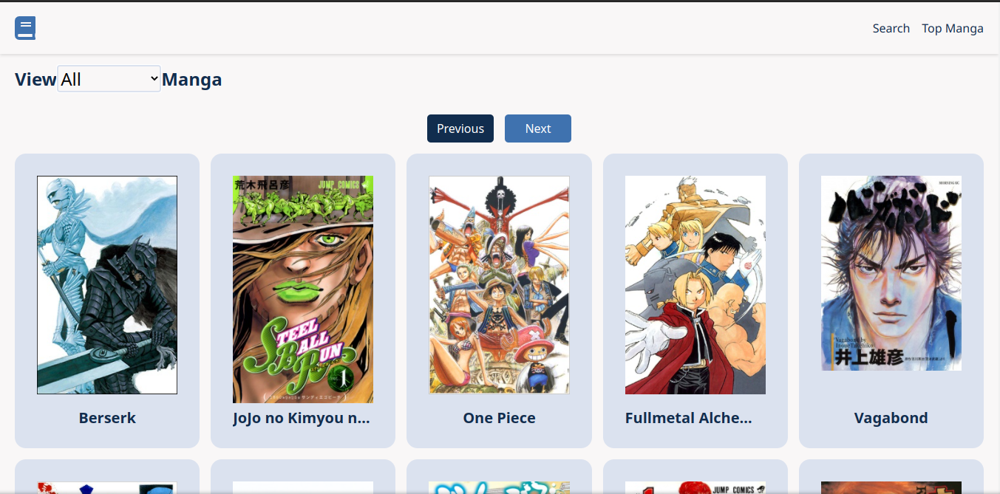

# Manga Central

> Manga Central is a web  app that lets you view information about Asian comics (manga).

This app lets you view top manga sorted by their scores on [MyAnimeList](https://myanimelist.net/). You can also search for particluar manga via a search box.

## Built With

- HTML, CSS, Javascript
- React/Redux

## Live Demo

[Live Demo Link](https://manga-central.netlify.app/)

## Getting Started

To get a local copy up and running follow these simple example steps.

### Prerequisites

- npm
- git

### Setup

Clone this repo.

### Install
Execute `npm install` in the root of the cloned repo to install the necessarry dependencies.

### Usage

Execute `npm start` to view the web app in your default browser.

### Run tests

Execute `npm test` to run the tests.

## Author

👤 **Meron Ogbai**

- Github: [@meronokbay](https://github.com/meronokbay)
- Twitter: [@MeronDev](https://twitter.com/MeronDev)
- Linkedin: [Meron Ogbai](https://linkedin.com/in/meron-ogbai/)

## 🤝 Contributing

Contributions, issues, and feature requests are welcome!

## Show your support

Give a ⭐️ if you like this project!

## Acknowledgments

- [Jikan](https://jikan.moe/)
- [MyAnimeList](https://myanimelist.net/)

## 📝 License

This project is [MIT](./LICENSE) licensed.
